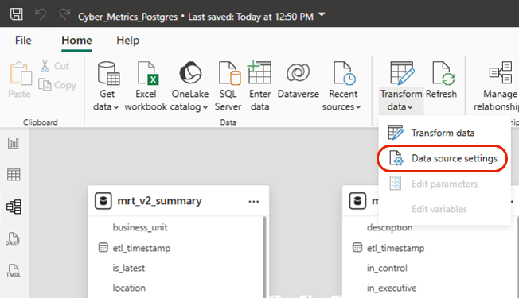

# PowerBI Template

A PowerBI template is provided as part of the solution accelerator.

* Import the [template](ccm-powerbi-template.pbit) into PowerBI
* Update the data source settings to point to your PostGres database.  Open the Data Model / **Transform Data** / **Data source settings**.

## Database TLS

When you try to connect to the database with SSL / TLS, you may be faced with a certificate error.  In order to resolve this, you will need to load the certificate from your cloud provider.

## Download the certificate

Download the right certificate for your cloud environment.

* [Azure](https://dl.cacerts.digicert.com/DigiCertGlobalRootCA.crt.pem)
* [AWS](https://truststore.pki.rds.amazonaws.com/ap-southeast-2/ap-southeast-2-bundle.p7b) (`ap-southeast-2`)
* GCP - Follow the [instructions](https://cloud.google.com/sql/docs/mysql/configure-ssl-instance) to generate a new certificate.

## Install the certificate

* On Windows, open the certificate manager. (Manage User Certificates)
* Right click on **Trusted Root Certificate Authorities** section, select **All Tasks** / **Import**.
* Click **Next**, and navigate to the folder where you downloaded the certificate.
   * You may need to change the file type to PKCS to see the p7b file)
* Import the certificate.

## More information

* https://docs.aws.amazon.com/AmazonRDS/latest/UserGuide/UsingWithRDS.SSL.html
* https://learn.microsoft.com/en-us/azure/mysql/flexible-server/how-to-connect-tls-ssl
* https://cloud.google.com/sql/docs/mysql/configure-ssl-instance
